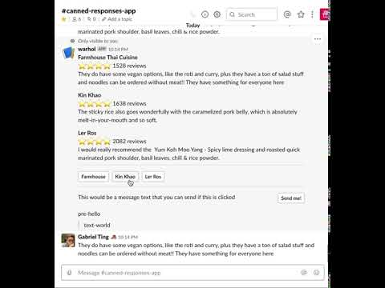

# warhol
Provides canned responses for slack through an ephemeral message menu on slash command /warhol. Written using @slack/bolt, the Slack WebAPI, Node.js, and hosted on Heroku.
# Demo

# Setup Instructions
The only dependency is `@slack/bolt`, so you can just do `npm i` and then `npm run start`.